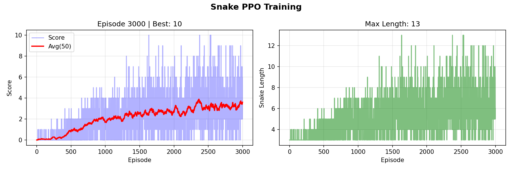

# 基于PPO算法的贪吃蛇游戏强化学习项目技术报告

---

## 1. 项目概述

本项目实现了一个基于 **近端策略优化（Proximal Policy Optimization, PPO）** 算法的贪吃蛇游戏智能体训练系统。系统采用Actor-Critic架构，通过深度强化学习训练智能体在贪吃蛇游戏中自主决策，实现自动游戏并不断优化策略。

### 1.1 项目目标
- 使用PPO算法训练智能体掌握贪吃蛇游戏
- 实现端到端的强化学习训练流程
- 提供可视化的训练过程和游戏演示

### 1.2 技术栈
- **深度学习框架**: PyTorch
- **游戏引擎**: Pygame
- **数值计算**: NumPy
- **可视化**: Matplotlib

---

## 2. 系统架构

### 2.1 整体架构设计

系统采用模块化设计，主要包含以下核心组件：

```
┌─────────────────┐
│   main.py       │  ← 训练流程控制与可视化
├─────────────────┤
│   ppo_agent.py  │  ← PPO算法实现（Actor-Critic网络）
├─────────────────┤
│   snake_env.py  │  ← 贪吃蛇游戏环境（状态、奖励、动作）
├─────────────────┤
│   config.py     │  ← 超参数配置
└─────────────────┘
```

### 2.2 数据流图

```
环境状态 → 状态编码 → Actor网络 → 动作概率分布 → 采样动作
                ↓
            Critic网络 → 状态价值估计
                ↓
            执行动作 → 环境反馈（奖励、新状态）
                ↓
            经验回放缓冲区 → PPO更新
```

---

## 3. PPO算法技术原理

### 3.1 PPO算法概述

PPO（Proximal Policy Optimization）是OpenAI在2017年提出的一种策略梯度算法，属于**on-policy**方法。PPO的核心思想是通过限制策略更新的幅度，避免策略更新过大导致训练不稳定。

### 3.2 核心数学原理

#### 3.2.1 策略梯度基础

在策略梯度方法中，目标函数为：

$$J(\theta) = \mathbb{E}_{\tau \sim \pi_\theta} [R(\tau)]$$

其中：
- $\theta$ 是策略参数
- $\pi_\theta$ 是参数化策略
- $R(\tau)$ 是轨迹的累积奖励

策略梯度定理给出：

$$\nabla_\theta J(\theta) = \mathbb{E}_{\tau \sim \pi_\theta} \left[ \sum_{t=0}^{T} \nabla_\theta \log \pi_\theta(a_t|s_t) \cdot \hat{A}_t \right]$$

其中 $\hat{A}_t$ 是优势函数估计。

#### 3.2.2 重要性采样

PPO使用重要性采样来重用旧策略收集的数据：

$$J(\theta) = \mathbb{E}_{a \sim \pi_{\theta_{old}}} \left[ \frac{\pi_\theta(a|s)}{\pi_{\theta_{old}}(a|s)} \hat{A}_t \right]$$

重要性采样比率：
$$r(\theta) = \frac{\pi_\theta(a|s)}{\pi_{\theta_{old}}(a|s)}$$

#### 3.2.3 PPO裁剪目标函数

PPO的核心创新是**裁剪机制**，防止策略更新过大：

$$L^{CLIP}(\theta) = \mathbb{E}_t \left[ \min \left( r_t(\theta) \hat{A}_t, \text{clip}(r_t(\theta), 1-\epsilon, 1+\epsilon) \hat{A}_t \right) \right]$$

其中：
- $\epsilon$ 是裁剪参数（通常为0.1或0.2）
- $r_t(\theta) = \frac{\pi_\theta(a_t|s_t)}{\pi_{\theta_{old}}(a_t|s_t)}$ 是重要性采样比率

**裁剪机制的作用**：
- 当优势为正且比率过大时，限制更新幅度
- 当优势为负且比率过小时，同样限制更新幅度
- 确保策略更新在合理范围内，提高训练稳定性

#### 3.2.4 完整PPO损失函数

本项目实现的PPO损失函数包含三个部分：

$$L(\theta) = L^{CLIP}(\theta) - c_v L^{VF}(\theta) + c_e L^{ENT}(\theta)$$

其中：

1. **策略损失**（裁剪）：
   $$L^{CLIP}(\theta) = -\mathbb{E}_t \left[ \min \left( r_t(\theta) \hat{A}_t, \text{clip}(r_t(\theta), 1-\epsilon, 1+\epsilon) \hat{A}_t \right) \right]$$

2. **价值函数损失**：
   $$L^{VF}(\theta) = \mathbb{E}_t \left[ (V_\theta(s_t) - \hat{R}_t)^2 \right]$$

3. **熵正则化**：
   $$L^{ENT}(\theta) = \mathbb{E}_t \left[ H(\pi_\theta(\cdot|s_t)) \right]$$

系数设置：
- $c_v = 0.5$：价值函数损失系数
- $c_e = 0.05$：熵正则化系数

### 3.3 优势估计：GAE（Generalized Advantage Estimation）

本项目使用GAE来估计优势函数，减少方差并提高学习效率。

#### 3.3.1 GAE公式

$$\hat{A}_t^{GAE(\gamma,\lambda)} = \sum_{l=0}^{\infty} (\gamma \lambda)^l \delta_{t+l}$$

其中时间差分误差：
$$\delta_t = r_t + \gamma V(s_{t+1}) - V(s_t)$$

递归形式（实际实现）：
$$\hat{A}_t = \delta_t + (\gamma \lambda) \hat{A}_{t+1}$$

参数设置：
- $\gamma = 0.99$：折扣因子
- $\lambda = 0.95$：GAE参数

**GAE的优势**：
- 在偏差和方差之间取得平衡
- $\lambda=0$ 时偏向低方差（但高偏差）
- $\lambda=1$ 时偏向低偏差（但高方差）
- $\lambda=0.95$ 是经验上的良好折中

### 3.4 算法流程

```
1. 初始化策略网络 π_θ 和价值网络 V_φ
2. for episode = 1 to N:
   3.   收集轨迹数据（使用当前策略）
   4.   计算回报和优势（GAE）
   5.   标准化优势
   6.   for epoch = 1 to K:
   7.       for batch in batches:
   8.           计算重要性采样比率 r(θ)
   9.           计算裁剪损失 L^CLIP
   10.          计算价值损失 L^VF
   11.          计算熵损失 L^ENT
   12.          总损失 = L^CLIP + c_v*L^VF - c_e*L^ENT
   13.          反向传播更新参数
   14.   清空缓冲区
```

---

## 4. 网络架构设计

### 4.1 Actor-Critic架构

本项目采用**共享参数的Actor-Critic架构**，即Actor和Critic共享底层特征提取层。

#### 4.1.1 网络结构

```python
输入层（状态维度：25）
    ↓
共享层1：Linear(25 → 512) + ReLU
    ↓
共享层2：Linear(512 → 512) + ReLU
    ↓
共享层3：Linear(512 → 512) + ReLU
    ↓
    ├─→ Actor分支：Linear(512 → 4) + Softmax → 动作概率分布
    └─→ Critic分支：Linear(512 → 1) → 状态价值
```

#### 4.1.2 设计优势

1. **参数共享**：减少参数量，提高训练效率
2. **特征复用**：Actor和Critic共享对状态的理解
3. **稳定训练**：共享特征有助于策略和价值函数的一致性

#### 4.1.3 激活函数选择

- **ReLU**：用于隐藏层，提供非线性变换
- **Softmax**：用于Actor输出层，确保动作概率和为1

### 4.2 状态空间设计

状态向量维度为25，包含以下信息：

| 特征类型 | 维度 | 描述 |
|---------|------|------|
| 直接危险检测 | 4 | 上下左右四个方向是否立即碰撞 |
| 射线距离检测 | 8 | 8个方向（上下左右+对角线）到障碍物的归一化距离 |
| 食物方向 | 4 | 食物在上下左右四个方向的布尔值 |
| 食物距离 | 2 | 食物在x和y方向的归一化距离 |
| 当前方向 | 4 | 当前移动方向（one-hot编码） |
| 蛇长度 | 1 | 归一化的蛇长度 |
| 头部位置 | 2 | 归一化的头部坐标 |

**状态设计原则**：
- **相对信息**：使用相对位置而非绝对坐标，提高泛化能力
- **归一化**：所有数值特征归一化到[0,1]，加速训练
- **多尺度感知**：结合直接危险和射线距离，提供多层次的障碍感知

### 4.3 动作空间

动作空间为离散的4个动作：
- 0：向上 (0, -1)
- 1：向下 (0, 1)
- 2：向左 (-1, 0)
- 3：向右 (1, 0)

**动作约束**：禁止180度转向（防止立即死亡）

---

## 5. 环境设计

### 5.1 奖励函数设计

奖励函数是强化学习中的关键设计，直接影响学习效果。

#### 5.1.1 奖励组成

1. **吃食物奖励**：
   $$R_{food} = 10.0 + 0.5 \times \text{length}$$
   - 基础奖励：10.0
   - 长度奖励：鼓励蛇变长

2. **距离奖励**：
   - 靠近食物：+0.1
   - 远离食物：-0.15
   - 引导智能体主动寻找食物

3. **生存惩罚**：
   - 长时间未吃食物（>100步）：-0.1/步
   - 防止智能体陷入循环

4. **死亡惩罚**：
   - 碰撞：-10.0
   - 步数超限：-5.0

#### 5.1.2 奖励设计原则

- **稀疏奖励问题**：通过距离奖励提供密集反馈
- **长期规划**：通过长度奖励鼓励长期策略
- **探索平衡**：通过生存惩罚防止过度保守

### 5.2 游戏规则

- **初始长度**：3节
- **游戏区域**：800×600像素，网格20×20
- **最大步数**：1000步（防止无限循环）
- **碰撞检测**：边界碰撞 + 自身碰撞

---

## 6. 训练流程详解

### 6.1 数据收集阶段

```python
for step in episode:
    state = env.get_state()
    action, log_prob, value = agent.get_action(state)  # 采样动作
    next_state, reward, done, info = env.step(action)
    buffer.add(state, action, reward, value, log_prob, done)
```

**关键点**：
- 使用当前策略采样动作（on-policy）
- 记录旧策略的log概率，用于重要性采样
- 记录状态价值，用于GAE计算

### 6.2 优势计算阶段

```python
# 计算GAE优势
returns, advantages = buffer.compute_gae(last_value, gamma, gae_lambda)
# 标准化优势（减少方差）
advantages = (advantages - advantages.mean()) / (advantages.std() + 1e-8)
```

**标准化优势的重要性**：
- 减少优势估计的方差
- 提高训练稳定性
- 加速收敛

### 6.3 策略更新阶段

```python
for epoch in range(NUM_EPOCHS):  # 多次更新
    for batch in batches:  # 小批量更新
        # 计算新策略的log概率
        new_log_prob, values, entropy = model.evaluate(states, actions)
        
        # 重要性采样比率
        ratio = exp(new_log_prob - old_log_prob)
        
        # PPO裁剪损失
        surr1 = ratio * advantages
        surr2 = clip(ratio, 1-ε, 1+ε) * advantages
        policy_loss = -min(surr1, surr2).mean()
        
        # 价值损失
        value_loss = MSE(values, returns)
        
        # 熵损失（鼓励探索）
        entropy_loss = -entropy.mean()
        
        # 总损失
        loss = policy_loss + value_coef * value_loss - entropy_coef * entropy_loss
        
        # 反向传播
        loss.backward()
        clip_grad_norm(model.parameters(), max_grad_norm)
        optimizer.step()
```

**关键机制**：

1. **多轮更新**：对同一批数据更新多次（NUM_EPOCHS=4），提高数据利用率
2. **梯度裁剪**：限制梯度范数（max_grad_norm=0.5），防止梯度爆炸
3. **学习率衰减**：指数衰减（lr_decay=0.9995），逐步细化策略

### 6.4 训练稳定性机制

#### 6.4.1 模型保存策略
- **最佳模型保存**：记录最高分数对应的模型
- **定期检查点**：每200个episode保存一次
- **崩溃恢复**：检测到性能崩溃时自动回滚到最佳模型

#### 6.4.2 性能监控
- **滑动平均**：50个episode的滑动平均分数
- **崩溃检测**：平均分数下降超过50%时触发回滚
- **可视化**：实时显示训练曲线

---

## 7. 超参数配置分析

### 7.1 网络参数

| 参数 | 值 | 说明 |
|------|-----|------|
| HIDDEN_SIZE | 512 | 隐藏层神经元数量，平衡表达能力和计算效率 |
| NUM_LAYERS | 3 | 网络深度，3层提供足够的非线性变换能力 |

### 7.2 学习参数

| 参数 | 值 | 说明 |
|------|-----|------|
| LEARNING_RATE | 5e-5 | 初始学习率，较小值保证稳定更新 |
| LR_DECAY | 0.9995 | 学习率衰减率，逐步细化策略 |
| GAMMA | 0.99 | 折扣因子，重视长期奖励 |
| GAE_LAMBDA | 0.95 | GAE参数，平衡偏差和方差 |

### 7.3 PPO特定参数

| 参数 | 值 | 说明 |
|------|-----|------|
| CLIP_EPSILON | 0.1 | 裁剪范围，限制策略更新幅度 |
| ENTROPY_COEF | 0.05 | 熵系数，鼓励探索 |
| VALUE_COEF | 0.5 | 价值损失权重 |
| MAX_GRAD_NORM | 0.5 | 梯度裁剪阈值 |

### 7.4 训练参数

| 参数 | 值 | 说明 |
|------|-----|------|
| NUM_EPISODES | 3000 | 训练轮数 |
| STEPS_PER_UPDATE | 4096 | 每次更新前收集的步数 |
| BATCH_SIZE | 128 | 小批量大小 |
| NUM_EPOCHS | 4 | 每次更新的轮数 |

**参数选择原则**：
- **保守更新**：较小的学习率和裁剪范围
- **充分探索**：适度的熵正则化
- **稳定训练**：梯度裁剪和学习率衰减

---

## 8. 实验结果与分析

### 8.1 训练指标

- **最佳分数**：训练过程中达到的最高分数
- **平均分数**：滑动窗口平均分数（反映稳定性）
- **蛇长度**：最大达到的蛇长度（反映策略质量）

### 8.2 训练曲线分析



训练过程通常呈现以下特征：

1. **初期探索阶段**（0-500 episodes）：
2. **快速提升阶段**（500-1500 episodes）：
3. **稳定优化阶段**（1500-3000 episodes）：

### 8.3 性能评估

**成功标准**：
- 能够稳定获得较高分数
- 避免简单碰撞错误
- 表现出一定的路径规划能力

---

## 10. 技术优势与创新点

### 10.1 技术优势

1. **PPO算法优势**：
   - 训练稳定，不易发散
   - 样本效率较高
   - 超参数鲁棒性好

2. **架构设计优势**：
   - Actor-Critic共享参数，提高效率
   - 状态表示丰富，信息充分
   - 奖励函数设计合理

3. **工程实现优势**：
   - 模块化设计，易于维护
   - 可视化训练过程
   - 崩溃恢复机制

---

## 11. 总结

本项目成功实现了基于PPO算法的贪吃蛇游戏智能体训练系统。通过合理的网络架构设计、精心设计的奖励函数和稳定的训练流程，系统能够有效训练智能体掌握贪吃蛇游戏。

**核心技术要点**：

1. PPO算法的裁剪机制保证训练稳定性
2. GAE优势估计提高学习效率
3. Actor-Critic架构实现策略和价值函数联合优化
4. 丰富的状态表示提供充分的环境信息
5. 合理的奖励函数引导智能体学习有效策略

本项目展示了深度强化学习在游戏AI领域的应用，为更复杂的强化学习任务提供了良好的基础框架。

---

## 参考文献

1. Schulman, J., et al. (2017). "Proximal Policy Optimization Algorithms." arXiv:1707.06347
2. Schulman, J., et al. (2015). "Trust Region Policy Optimization." ICML 2015
3. Schulman, J., et al. (2015). "High-Dimensional Continuous Control Using Generalized Advantage Estimation." ICLR 2016

---

